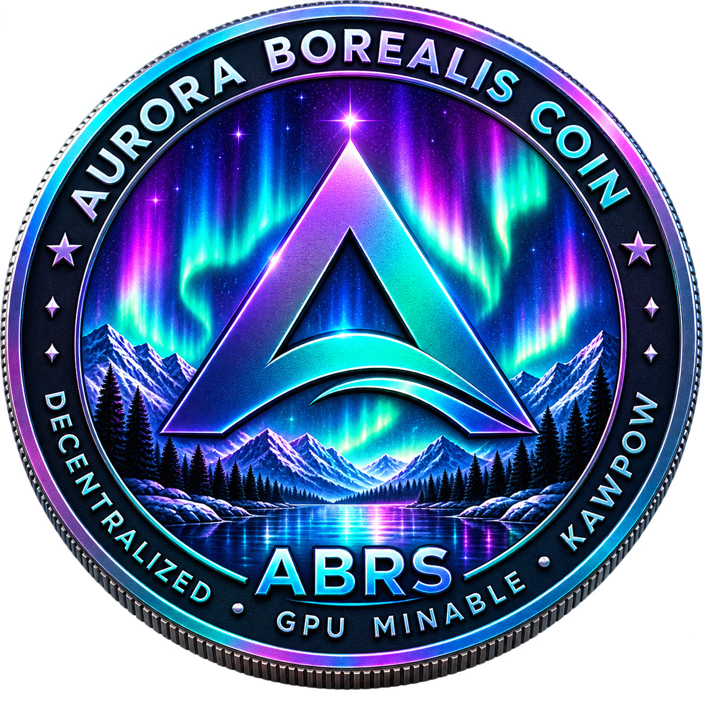

<p align="center">
  
</p>

# Aurora Borealis Core (ABRS)

**Aurora Borealis Coin** is an independent open-source peer-to-peer blockchain network.

**Ticker:** ABRS
**Core:** Aurora Borealis Core
**Official website:** https://auroraborealiscoin.com/
**Explorer:** https://explorer.auroraborealiscoin.com/
**Mining Pool:** https://pool.auroraborealiscoin.com/
**Faucet:** https://faucet.auroraborealiscoin.com/

---

## Aurora Borealis Coin

Aurora Borealis Coin (ABRS) is a peer-to-peer digital asset with its own independent blockchain.

Aurora Borealis Core provides:

- full node support;
- peer-to-peer networking;
- blockchain validation;
- wallet functionality;
- transaction creation and verification;
- mining and consensus functionality;
- mainnet, testnet and regtest environments;
- graphical Qt wallet;
- command-line interface and daemon.

---

## Current Release

### Aurora Borealis Core 4.6.3

The current Linux x86-64 release includes:

- `auroraborealis-qt`
- `auroraborealisd`
- `auroraborealis-cli`

Official releases:

https://github.com/auroraborealiscoin/auroraborealis/releases

---

## Network

Aurora Borealis Core supports:

- Mainnet
- Testnet
- Regtest

Payment URI scheme:

`auroraborealis:`

---

## Premine

Aurora Borealis mainnet includes a consensus-enforced premine at block #1.

| Allocation | Amount |
|---|---:|
| Founder | 210,000,000 ABRS |
| Treasury | 210,000,000 ABRS |
| **Total** | **420,000,000 ABRS** |

Founder address:

`AeaBek4B389g2pkxdRgn3SGznQfwJgj9ns`

Treasury address:

`AeQqDnuyPc1dZt4HRLapm9Vv3zxuBj6pDx`

Consensus-derived supply figures:

- Mining emission: approximately **3,779,999,999.727 ABRS**
- Total theoretical created supply: approximately **4,199,999,999.727 ABRS**
- Unspendable genesis output: **900 ABRS**
- Maximum spendable supply: approximately **4,199,999,099.727 ABRS**
- Premine: approximately **10.000002%** of maximum spendable supply

---

## Building

```bash
./autogen.sh
./configure
make
---

## Security

See [SECURITY.md](SECURITY.md) for security reporting guidance.

## Roadmap

See [ROADMAP.md](ROADMAP.md).

## Whitepaper

The official Aurora Borealis Coin whitepaper will be maintained in this repository.

## Open-Source Lineage

Aurora Borealis Core contains code derived from earlier open-source blockchain projects, including Ravencoin Core and Bitcoin Core.

Aurora Borealis Coin is an independent network with its own consensus parameters, chain history, network identity, infrastructure and economic parameters.

Upstream copyright and license notices are retained where required.
